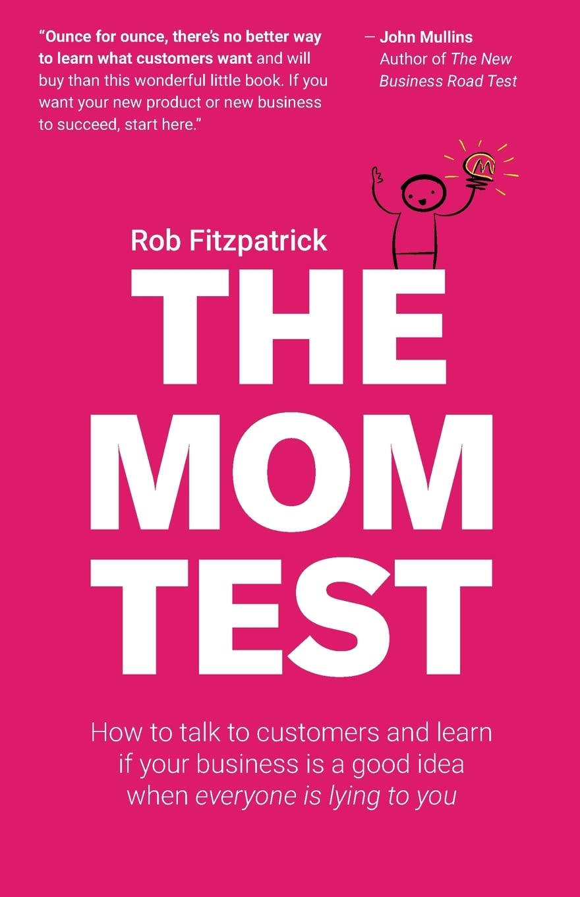

# The mom test

这是一本讲销售的书。哦，或许不是，这是一本讲如何调研需求的书。这是一本决定你创业方向的书。这是一本你获得真相的书。

嘿，我有一个锤子。哪里有钉子！

我想到一个 idea，我的用户一定需要这个，肯定有很多人都需要这个。而且已经告诉好多人我的想法了，他们都很赞成，都觉得我的想法非常好！他一定很受欢迎！发财的机会来了！！

产品上线，使用者寥寥。你压抑着怒火，询问你的采访者，他们明明答应你说他们一定回来用的，他们明明说他们很喜欢的你的产品的，他们都是骗子！

---

没有人想骗你，相反他们反而是为了鼓励你，照顾你面子，不想打击你的朋友。你兴冲冲的告诉他们你的想法，脸上挂满了笑容，他们怎么忍心当面说你的想法不切实际呢？他们也不是职业投资人，他们怎么能确切的知道你的产品会不会成功呢？难道他面对你充满激情演讲过后，还好意思说你的产品他并不看好么？

即使被采访者是一个冷静、有经验、敢于直言的人。但是人类的心口不一的行为也实在太多。即使当前想的是这样，落实在行为习惯上又会是其他模样。你去问他们是否希望自己更健康，他们未来是否有各种健身计划？他们会说是的，我打算未来去多打打羽毛球、跑跑步，我以后再也不吃夜宵了！但是实际情况呢？

所以我们需要的是事实，是他历史中的行为习惯，是一步步确切的行动。而不是他的记忆中的昨天，许诺好的明天，不是他的赞美，不是他的拖延战术。

怎样才能获得事实？一步步推进我们产品的迭代呢？

## 怎样提问？

正如书名，mom test，想象你在向你的 mom 询问你的创业想法，如果你直接说出你的创业想法，比如书中给的例子你希望开发一个软件，是一个 pad 上面的菜谱 app。你 mom 说：“大宝贝，真棒，我正需要一个菜谱呢，这样我就能给你做好多好吃的了！”

但实际上你 mom 平时用 pad 都很少，更不用说用 pad 去下载一个菜谱 app 学做饭了。而且你 mom 可能也不想看菜谱做饭，她做了几十年的饭了，哪里还需要看菜谱呢？除非是那种很不一样的菜，而那种菜她真的会特地下载一个 app 去学习做这一种菜么？

所以，很重要的一点就是：不要暴露自己的想法，然后去问用户你这个想法好不好，他们很可能会说好，然后赞美你。

你需要的是真实的用户使用记录，真实的用户行为习惯。我们在谈话中只是在尽量获取用户的真实信息，而不是让他们赞赏我们有多么好的想法，或者用户有多么好的想法。

### 正确的提问

You：hi mom，最近可不可以换点其他菜啊，总是吃那几种，吃腻了

Mom：好呀，你想吃啥？

You：我也不知道想吃什么，你要不从网上搜搜，看看最近有哪些好吃的？

Mom：哦，我去抖音上看看，现在有啥时髦的菜

You：抖音？你会怎么搜索呢？

Mom：我关注了好多博主呢，他们都会做好多菜，我一直想尝试，正好最近试试！

You：如果有一个 app 能够教你做各种菜，你会去下载么？

Mom：我不会，我不想下载那么多 app，就在抖音上看看就行了嘛

You：如果有个抖音小程序是教你做菜的，你会进去看看么？

Mom：那应该会，反正不用额外下载新东西

You：那你一般会尝试怎么样的菜系呢？川菜、甜点、清蒸鱼？

Mom：……

ok，以上就是你新的提问方式。你知道了你的获客渠道（抖音博主）、应该开发抖音小程序而不是 app、用户的年龄、用户会找的菜系等等

这也意味着，不要向用户推销你的产品。不要说你的产品多好，只是询问用户遇到的问题，他们的痛点，这是否真的是他们的痛点等。

## 不要用正式的会议

不应该用正式的会议去进行用户访谈，应该用更加随意的方式去询问用户的信息。你可以在任何地方进行采访，比如还是上文说的菜谱产品，比如你想聊你这个产品的目标用户、获客渠道、用户使用习惯、你应该推荐何种菜系、如何商业变现（软件订阅？广告？分成？）、如何推广？等等诸如此类的问题，你想找一个专业的人士去聊，然后你发送邮件、约定某日的几点到几点、提前准备问题。在这种正式的环境下，人们的戒备心反而很强，你可能得不到更加真实的信息。第二就是，相对于随时随地的交流沟通，那种正式的会议获取信息的效率更低。

大家可能听到过一个笑话，会议只是来宣布结果的，真正的决定私底下早已做好了。我们从各种传记中、各种访谈中也可以看到，很多重要的信息、重要的决定，就是从各种随机的谈话中就改变了。正式的会议，更像是举手表决，表达立场，进行投票的地方。

## 细分

这是讲关于产品、业务方向，应该确定自己的用户群体是谁，应该聚焦某一个用户群体。否则你的产品会四不像。

书中说的细分，是指你访谈了很多用户，你收到了很多用户的反馈，一部分用户说应该做 A 功能，一部分用户说应该做 B 功能，一部分用户是 20 岁年轻人，一部分用户是 40 岁中年人。这时你需要考虑，你的目标用户到底是谁，只有弄清楚目标用户是谁，你才知道什么不该做。

## 会议

上文说的不要正式会议，说的是你获取用户使用习惯、获取用户痛点、获取行业信息等等，不用拘泥于非要约个正式会议去得到信息。

这里说的会议基本指正式的商务合作了，看起来更像是一种 ToB 的销售技巧。

### 会议前

应该进行简要的调查，确定会议应该询问哪些事情，接着往下推进哪些事情。比如签署合同，或者找下一个联络人（企业中的实际目标用户大概率并不是最终决定付款的人）。

### 会议中

应该根据 **mom test 的方式去询问**（获得用户真实信息），转移赞美。并且记录笔记。并且想办法获得承诺和推进下一步

### 会议后

回顾笔记，并且分享笔记，尽量不失真的传递信息。应该将会议中的信息分享给所有人，比如离销售比较远的研发团队。很多时候销售团队去参加了会议，得到了用户提出的 1、2、3 点需求，经过销售自己的脑子转化后，得到了需求 A、B、C，转头就对产研团队说，用户需要功能 A、B、C，但是实际上信息根本就不是这样的。

我记得我从《Company of one》这本书中看到一个例子：

>
> 用户说他们需要一个炫酷的图表界面，界面里面包含了各种指标、饼图、直方图，能够清晰的看到近一个月他们的项目的各项指标。然后呢产研部门花了三个月时间开了一个非常炫酷的界面，并且支持各种格式的文件的导出。但是最后发现呢，用户需要那个炫酷的界面，只是他们的供应商需要看那个界面，以此来增强他们供应商的信心，里面的各种数字并不重要，只是需要一个炫酷界面罢了。最后产研部门反思，如果能够提前知道用户只是需要一个炫酷界面，不关心实际数字的话，他们只需要几天的开发时间就能完成，而不是浪费了几个月。

## 书中最重要的观点

这本书最重要的部分就是他的提问方式，我们大多数人做的，就是兴冲冲的向别人介绍自己的产品，然后等待别人的夸赞，但这对于产品的改善毫无意义。我们真正应该做的是尽可能获取用户真实的行为习惯，而不是赞美和用户虚无缥缈的对未来的想象。

这不仅仅对于销售是这样，只要是你想要获取其他人真实想法，那么你就不应该过早暴露自己的想法。这在一个充满等级的会议中是很容易想象的，会议中的领导人不可以最先表明自己的主张，否则他将只能得到其他人的附和了。

对于用户对自己历史的回忆和对未来的想象，也要谨慎看待，即使用户说的都是真心的，从心理学看，人类当前的心理是可以影响他对历史的记忆的。所以想要获得真实的信息，应该看用户的行为习惯，习惯是很难改变的，这个足够真实。
